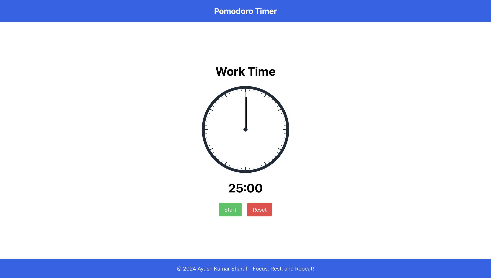

# Pomodoro Timer

A sleek and interactive Pomodoro Timer built with React and Next.js. This application helps you manage your work sessions and breaks effectively using the Pomodoro Technique.

# Live Project

Here is the deployed version of the tool [Pomodoro Timer](https://pomodoro-timer-tan.vercel.app/)



## Features

- 25-minute work sessions and 5-minute break sessions
- Visual clock face with minute and second hands
- Start, stop, and reset functionality
- Automatic switching between work and break sessions
- Responsive design

## Technologies Used

- React
- Next.js
- Tailwind CSS

## Getting Started

### Prerequisites

- Node.js (v14 or later)
- npm or yarn

### Installation

1. Clone the repository:
   ```
   git clone https://github.com/ayush-sharaf/Pomodoro-Timer.git
   ```

2. Navigate to the project directory:
   ```
   cd Pomodoro-Timer
   ```

3. Install dependencies:
   ```
   npm install
   ```
   or if you're using yarn:
   ```
   yarn install
   ```

### Running the Application

1. Start the development server:
   ```
   npm run dev
   ```
   or with yarn:
   ```
   yarn dev
   ```

2. Open your browser and visit `http://localhost:3000`

## Usage

1. When you open the application, you'll see the timer set to 25 minutes for a work session.
2. Click the "Start" button to begin the timer.
3. The clock hands will move to show the remaining time visually.
4. When the work session ends, a notification will appear (if permitted), and the break session will start automatically.
5. You can stop the timer at any time by clicking the "Stop" button.
6. To reset the timer to the beginning of a work session, click the "Reset" button.

## Customization

You can easily customize the work and break durations by modifying the `workTime` and `breakTime` constants in the `Home` component.

## Contributing

Contributions are welcome! Please feel free to submit a Pull Request.

## Acknowledgements

- This project was inspired by the Pomodoro Technique developed by Ayush Kumar Sharaf.
- Clock face design inspired by traditional analog clocks.
